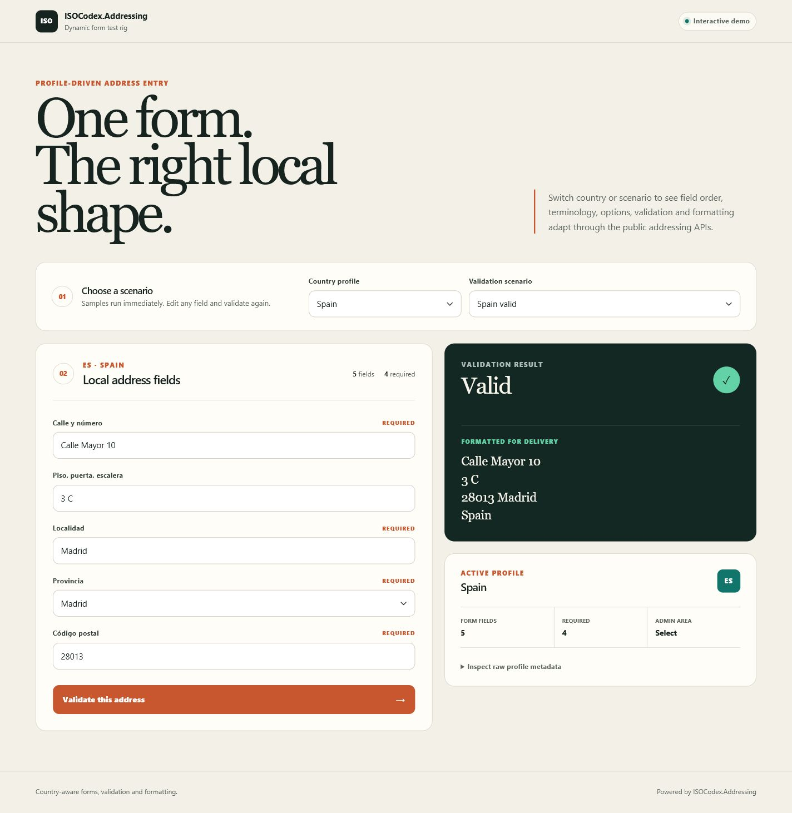
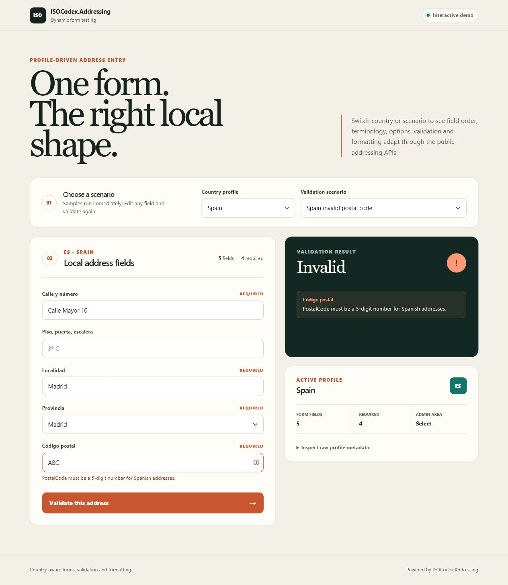
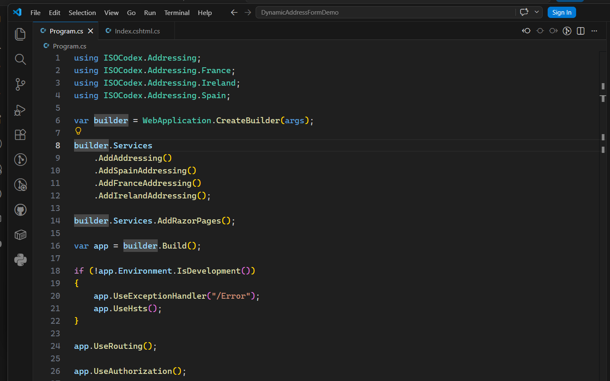
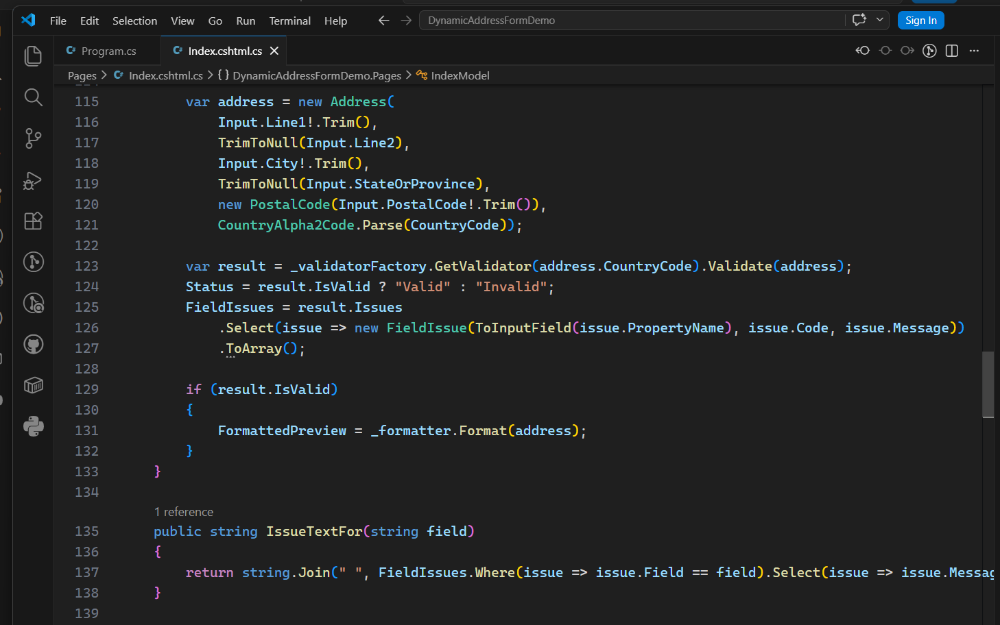

# DynamicAddressFormDemo

Portfolio-quality Razor Pages test rig for a back-office address entry screen that changes fields based on `IAddressProfileProvider` metadata.

## Countries

Uses Spain, France, and Ireland. Spain demonstrates select-style administrative areas; France and Ireland demonstrate freer text administrative-area behaviour.

## Run

```bash
dotnet run --project ExtendedTestRigs/DynamicAddressFormDemo --urls http://localhost:5001
```

Open `http://localhost:5001`.

## Screenshots





## Code in use

The demo's integration is small enough to inspect directly. These captures show the real service registration and the request path that constructs, validates and formats an address.





## Reproduce the capture state

Open this deterministic scenario URL after starting the app:

```text
http://localhost:5001/?CountryCode=ES&SampleId=es-valid
```

Selecting any sample loads and validates it immediately. The checked-in screenshots use the Spanish valid and invalid-postal-code scenarios with the raw metadata panel collapsed.

## Portfolio capture contract

[`portfolio-captures.json`](portfolio-captures.json) gives agents stable scenario URLs, viewport sizes, output filenames, alt text and evidence-backed captions. The main capture surface is also marked with:

```css
[data-portfolio-capture="address-form-demo"]
```

Within it, `data-portfolio-region` identifies the scenario controls, generated form, validation result and profile evidence. This keeps screenshot automation independent of presentational CSS classes.

Useful, supportable portfolio claims include:

- One public profile API drives country-specific labels, field order, required state and select options.
- The same test rig exercises valid and invalid paths through country-specific validators.
- Valid addresses are rendered through the package formatter rather than a demo-only template.
- Spain, France and Ireland demonstrate structurally different address-entry conventions.

## Features exercised

- Profile-driven field order, labels, required flags, placeholders, and input kind.
- Select options for Spanish provinces.
- Free-text administrative areas for France and Ireland.
- Posting the generated form back through country-specific validation.
- Field-level validation issue display.
- Valid and invalid sample addresses loaded and validated immediately from the UI.

## Known limitations

- The form uses a small local mapping layer from profile fields to the library's `Address` constructor.
- Only the fields represented by the core `Address` model can be posted.
- Raw profile JSON remains available in a collapsed diagnostic panel.
